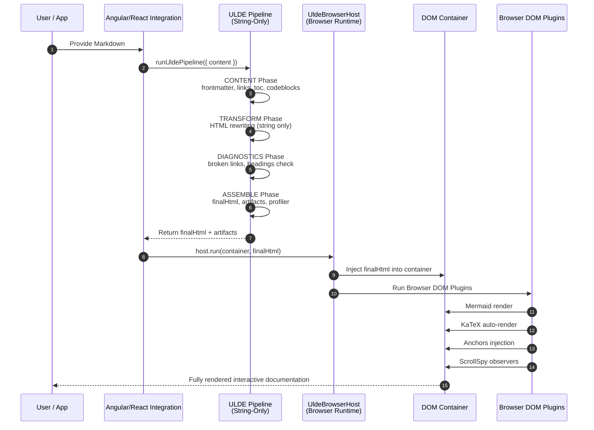

# PlugIn Flow Diagram

- A Sequence Diagram showing the full flow <br>
Markdown → Pipeline → Host → Browser Plugins → DOM

- A Plugin Lifecycle Diagram showing how each plugin moves through its lifecycle
beforeRun → run → afterRun → timings → artifacts

Both diagrams are drop‑in ready for your documentation.

## 1. ULDE‑MODEL‑01 Sequence Diagram

__(Markdown → Pipeline → Host → Browser Plugins)__



## 2. ULDE‑MODEL‑01 Plugin Lifecycle Diagram

__(beforeRun → run → afterRun → timings → artifacts)__

```mermaid
flowchart TD

    subgraph Plugin["ULDE Pipeline Plugin Lifecycle"]
        direction TB

        A[Plugin Loaded<br/>from Registry] --> B[beforeRun(ctx)]
        B --> C[run(ctx)]
        C --> D[afterRun(ctx)]
        D --> E[Record Timing<br/>ctx.artifacts.timings.add()]
        E --> F[Update Artifacts<br/>ctx.artifacts.*]
    end

    %% Context Flow
    subgraph Context["UldePhaseContext"]
        direction TB
        X1[content] --> X2[html]
        X2 --> X3[finalHtml]
        X3 --> X4[diagnostics]
        X4 --> X5[timings]
        X5 --> X6[artifactsPanel]
        X6 --> X7[debugOverlay]
    end

    F --> Context

```

__🌟 What These Diagrams Capture__

✔ Sequence Diagram

- Shows the entire ULDE‑MODEL‑01 flow:
- Markdown enters Angular/React
- Pipeline runs 4 phases (string‑only)
- BrowserHost injects HTML
- Browser plugins enhance the DOM

✔ Plugin Lifecycle Diagram

- Shows how each plugin behaves:
- Loaded from registry
- beforeRun()
- run()
- afterRun()
- Timings recorded
- Artifacts updated

This is the exact lifecycle your ULDE‑MODEL‑01 orchestrator implements.
