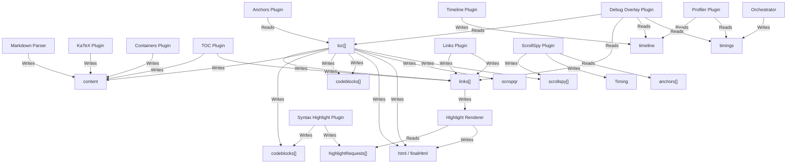

# 1. field‑centric ownership graph

```mermaid
graph TD
  %% Core content pipeline
  MarkdownParser["Markdown Parser"] -->|Writes| Content["content"]
  KaTeXPlugin["KaTeX Plugin"] -->|Writes| Content
  ContainersPlugin["Containers Plugin"] -->|Writes| Content

  %% Structural data
  TOCPlugin["TOC Plugin"] -->|Writes| Content
  TOCPlugin["TOC Plugin"] -->|Writes| Links["links[]"]
  Toc["toc[]"] -->|Writes| Links
  Toc["toc[]"] -->|Writes| Content
  Toc["toc[]"] -->|Writes| Codeblocks["codeblocks[]"]
  Toc["toc[]"] -->|Writes| Codeblocks2["codeblocks[]"]
  Toc["toc[]"] -->|Writes| Codeblocks2
  Toc["toc[]"] -->|Writes| Html["html / finalhtml"]
  Toc["toc[]"] -->|Writes| Html["html / finalhtml"]
  Toc["toc[]"] -->|Writes| Dummy["ocnspqr"]
  Toc["toc[]"] -->|Writes| Scrollspy["scrollspy[]"]


  LinksPlugin["Links Plugin"] -->|Writes| Links
  Links -->|Writes| HighlightRenderer["Highlight Renderer"] 

  ScrollSpyPlugin["ScrollSpy Plugin"] -->|Writes| Scrollspy
  ScrollSpyPlugin -->|Writes| Timong["Timing"]

  AnchorsPlugin["Anchors Plugin"] -->|Reads| Toc
  DebugOverlayPlugin["Debug Overlay Plugin"] -->|Reads| Toc

  %% Links metadata
  LinksPlugin -->|Writes| Links["links[]"]
  DebugOverlayPlugin -->|Reads| Links

  %% Renderer and highlight
  SyntaxHighlightPlugin["Syntax Highlight Plugin"] -->|Writes| Codeblocks
  SyntaxHighlightPlugin -->|Writes| HighlightRequests["highlightRequests[]"]
  HighlightRenderer["Highlight Renderer"] -->|Reads| HighlightRequests
  HighlightRenderer -->|Writes| Html["html / finalHtml"]

  %% Navigation
  ScrollSpyPlugin["ScrollSpy Plugin"] -->|Reads| Anchors["anchors[]"]

  %% DevTools and system
  TimelinePlugin["Timeline Plugin"] -->|Writes| Timeline["timeline"]
  ProfilerPlugin["Profiler Plugin"] -->|Reads| Timeline
  DebugOverlayPlugin -->|Reads| Timeline
  Orchestrator["Orchestrator"] -->|Writes| Timings["timings"]
  DebugOverlayPlugin -->|Reads| Timings
  ProfilerPlugin -->|Reads| Timings

```
