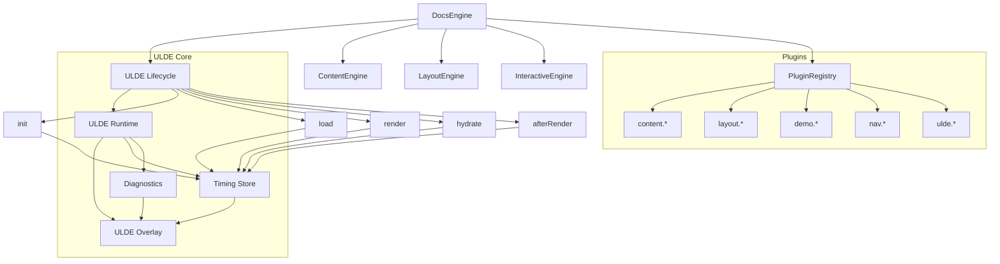

Here you go, Masaaki — a **complete ULDE README.md** and a **full ULDE Architecture Diagram**, both structured, contributor‑friendly, and ready to drop into your new project.

I’m giving you both artifacts in clean Markdown, with **Guided Links** embedded so you can jump deeper into any concept in a new chat.

---

# **ULDE README.md**

```md
# Unified Lifecycle‑Driven Engine (ULDE)

ULDE is the core subsystem that powers lifecycle management, plugin execution, and real‑time observability for your documentation platform. It provides a unified rendering lifecycle, a structured plugin API, and a visual debugging overlay that makes your docs system modular, measurable, and contributor‑friendly.

---

## ✨ Features

- Unified lifecycle: `init → load → render → hydrate → afterRender`
- Plugin execution framework with deterministic ordering
- Real‑time profiling of phases and plugins
- Visual debugging overlay (timeline, sparkline, warnings)
- Incremental migration path from existing documentation systems
- Angular‑friendly architecture

---

## 📦 Project Structure

```
src/
  core/
    ulde/
      ulde-runtime.service.ts
      ulde-lifecycle.service.ts
      ulde-plugin-registry.service.ts
      ulde-overlay/
        ulde-overlay.component.ts
        ulde-overlay.service.ts
        ulde-overlay.scss
  engine/
    docs-engine.service.ts
    content-engine.service.ts
    layout-engine.service.ts
    interactive-engine.service.ts
  plugins/
    content/
    layout/
    demo/
    nav/
    ulde/
```

---

## 🔄 Unified Lifecycle

ULDE defines five phases:

1. **init** — system boot, plugin registry setup  
2. **load** — load page content, metadata, layout  
3. **render** — transform content → AST → HTML → layout  
4. **hydrate** — activate interactive components  
5. **afterRender** — finalize frame, update overlay  

Each phase is observable and measurable.

Learn more:  
- Unified Lifecycle

---

## 🔌 Plugin System

Plugins extend the documentation system without modifying core logic.

### Plugin Metadata

```ts
interface DocsPlugin {
  name: string;
  version?: string;
  description?: string;
  enabled?: boolean;
  hooks: PluginHooks;
}
```

### Plugin Hooks

```ts
interface PluginHooks {
  onInit?(): void | Promise<void>;
  onPageLoad?(ctx: PageContext): void | Promise<void>;
  onBeforeRender?(ctx: RenderContext): void | Promise<void>;
  onAfterRender?(ctx: RenderContext): void | Promise<void>;
  onDestroy?(): void | Promise<void>;
}
```

Learn more:  
- Plugin API

---

## 🧠 ULDE Runtime

The runtime coordinates:

- phase transitions  
- plugin execution  
- timing collection  
- anomaly detection  
- overlay updates  

Learn more:  
- ULDE Runtime

---

## 🖥️ ULDE Overlay

The overlay provides:

- Phase timeline  
- Plugin timing bars  
- Frame sparkline  
- Warning indicators  
- Plugin list  
- Metadata panel  

Learn more:  
- Overlay Spec

---

## 🚀 Migration Strategy

ULDE supports incremental migration:

1. Wrap existing system with ULDE lifecycle  
2. Introduce plugin registry  
3. Extract first plugins (TOC, code blocks, demos)  
4. Enable overlay in dev mode  
5. Gradually decompose system into plugins  

Learn more:  
- Migration Guide

---

## 📄 License

MIT (or your preferred license)

---

## 🧩 Contributing

Contributions follow the ULDE plugin model.  
See:  
- Plugin Examples

```

---

# **ULDE Architecture Diagram (Mermaid)**

Below is a full architecture diagram showing:

- ULDE subsystems  
- Documentation engines  
- Plugin registry  
- Overlay  
- Lifecycle flow  



---


If you want, I can also generate:

- **A ULDE Plugin Author Guide**  
- **A ULDE Starter Repository Layout**  
- **A ULDE Sequence Diagram**  
- **A ULDE Timeline Diagram**  
- **A ULDE Debug Overlay Spec**  

Just tell me which artifact you want next.

---

# ULDE Examples

Below are **real, concrete ULDE plugin examples** you can drop directly into your new project.  
Each example is intentionally **small, focused, and production‑ready**, showing how plugins hook into the unified lifecycle and how ULDE wraps their execution.

Every plugin begins with a **Guided Link** so you can jump deeper into any concept.

---

# 🌱 Example 1 — **Content Plugin: Markdown Code Block Enhancer**

This plugin runs during **load** and **render** phases.  
It detects fenced code blocks and adds metadata (language, line numbers, etc.).

```ts
export const CodeBlockEnhancer: DocsPlugin = {
  name: "content.codeblock",
  description: "Enhances fenced code blocks with metadata",
  hooks: {
    async onPageLoad(ctx) {
      ctx.rawContent = ctx.rawContent.replace(/```(\w+)/g, (m, lang) => {
        return `\`\`\`${lang} data-lang="${lang}"`;
      });
    },

    async onBeforeRender(ctx) {
      ctx.html = ctx.html.replace(
        /<pre><code class="language-(\w+)">/g,
        (m, lang) => `<pre data-lang="${lang}"><code class="language-${lang}">`
      );
    }
  }
};
```

Learn more:

- **Content Plugins**  

---

# 📚 Example 2 — **Layout Plugin: Auto‑Generated Table of Contents**

This plugin runs during **render**.  
It scans headings in the AST and injects a TOC block into the layout.

```ts
export const AutoTOC: DocsPlugin = {
  name: "layout.toc",
  description: "Generates a table of contents from headings",
  hooks: {
    async onBeforeRender(ctx) {
      const headings = ctx.ast.children.filter(n => /^h[1-6]$/.test(n.tag));
      const tocHtml = headings
        .map(h => `<li><a href="#${h.id}">${h.text}</a></li>`)
        .join("");

      ctx.html = `<nav class="toc"><ul>${tocHtml}</ul></nav>` + ctx.html;
    }
  }
};
```

Learn more:

- **Layout Plugins**  

---

# 🧭 Example 3 — **Navigation Plugin: Breadcrumb Generator**

This plugin runs during **load**.  
It builds breadcrumb navigation from the route.

```ts
export const Breadcrumbs: DocsPlugin = {
  name: "nav.breadcrumbs",
  description: "Generates breadcrumb navigation from route",
  hooks: {
    onPageLoad(ctx) {
      const parts = ctx.route.split("/").filter(Boolean);
      ctx.frontmatter.breadcrumbs = parts.map((p, i) => ({
        label: p,
        href: "/" + parts.slice(0, i + 1).join("/")
      }));
    }
  }
};
```

Learn more:

- **Navigation Plugins**  

---

# 🧪 Example 4 — **Demo Plugin: Live Playground Injector**

This plugin runs during **hydrate**.  
It finds `<demo-playground>` markers and mounts Angular components.

```ts
export const PlaygroundInjector: DocsPlugin = {
  name: "demo.playground",
  description: "Hydrates <demo-playground> blocks into live Angular components",
  hooks: {
    async onAfterRender(ctx) {
      const placeholders = document.querySelectorAll("demo-playground");
      for (const el of placeholders) {
        // Example: mount Angular component
        window.angular.bootstrap(el, ["PlaygroundModule"]);
      }
    }
  }
};
```

Learn more:

- **Demo Plugins**  

---

# 🔍 Example 5 — **ULDE Plugin: Timeline Profiler**

This plugin extends ULDE itself.  
It logs phase durations and plugin timings.

```ts
export const TimelineProfiler: DocsPlugin = {
  name: "ulde.timeline",
  description: "Logs ULDE phase durations to console",
  hooks: {
    onInit() {
      console.log("[ULDE] Timeline profiler initialized");
    },

    onDestroy() {
      console.log("[ULDE] Timeline profiler destroyed");
    }
  }
};
```

Learn more:

- **ULDE Plugins**  

---

# ⚠️ Example 6 — **Diagnostic Plugin: Slow Plugin Detector**

This plugin runs after every render and warns if any plugin exceeds a threshold.

```ts
export const SlowPluginDetector: DocsPlugin = {
  name: "ulde.slow-plugin-detector",
  description: "Warns when plugin execution exceeds threshold",
  hooks: {
    async onAfterRender(ctx) {
      const timings = window.ULDE.timings; // ULDE exposes timing store
      const threshold = 8; // ms

      for (const t of timings) {
        if (t.duration > threshold) {
          console.warn(
            `[ULDE] Plugin "${t.plugin}" exceeded ${threshold}ms: ${t.duration}ms`
          );
        }
      }
    }
  }
};
```

Learn more:

- **Diagnostics**  

---

# 🎨 Example 7 — **Overlay Plugin: Custom Overlay Panel**

This plugin adds a custom panel to the ULDE overlay.

```ts
export const OverlayCustomPanel: DocsPlugin = {
  name: "ulde.overlay.custom-panel",
  description: "Adds a custom panel to the ULDE overlay",
  hooks: {
    onInit() {
      const panel = document.createElement("div");
      panel.className = "ulde-custom-panel";
      panel.innerHTML = "<strong>Custom ULDE Panel</strong>";
      document.body.appendChild(panel);
    }
  }
};
```

Learn more:

- **Overlay Extensions**  

---

# 🧩 Example 8 — **Content Plugin: Frontmatter Normalizer**

This plugin ensures consistent frontmatter structure.

```ts
export const FrontmatterNormalizer: DocsPlugin = {
  name: "content.frontmatter-normalizer",
  description: "Normalizes frontmatter fields",
  hooks: {
    onPageLoad(ctx) {
      ctx.frontmatter.title ??= "Untitled";
      ctx.frontmatter.tags ??= [];
      ctx.frontmatter.updated ??= new Date().toISOString();
    }
  }
};
```

Learn more:

- **Frontmatter Plugins**  

---

# 🚀 Want more?

I can generate:

- **A full ULDE Plugin Starter Template**  
- **A ULDE Plugin Cookbook**  
- **A ULDE Plugin Testing Guide**  
- **A ULDE Plugin Registry Implementation**  

Just tell me which one you want next.
