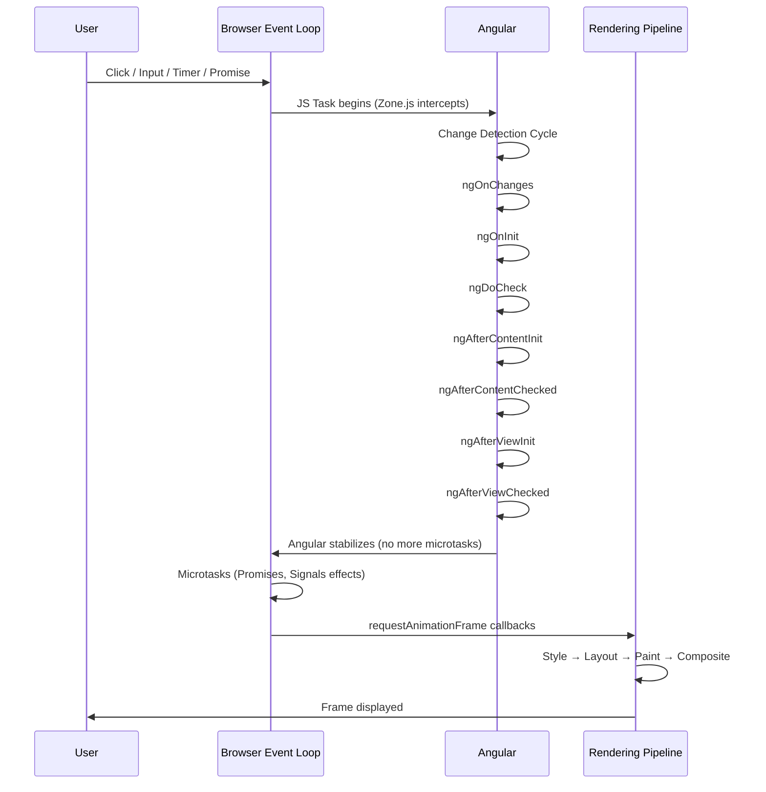
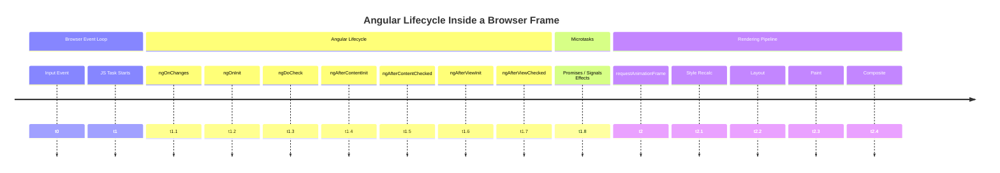

# Angular’s internal reactivity/lifecycle and the browser’s frame-by-frame rendering lifecycle.
---
## 1. How Angular’s Lifecycle Relates to the Browser’s Frame Lifecycle

Angular does not run independently of the browser.
It rides on top of the browser’s event loop and frame lifecycle.

The key idea:

Angular schedules work inside the browser’s macro/microtask queues, and the browser renders frames after Angular has stabilized.

Angular’s lifecycle hooks (ngOnInit, ngAfterViewInit, etc.) are not tied to frames, but they execute inside the same event loop ticks that eventually lead to a frame render.

---
## 2. The Browser Frame Lifecycle (simplified)

A single browser frame (~16.6ms at 60fps) looks like this:
```
┌──────────────────────────────────────────────────────────────┐
│ 1. Handle input events (click, scroll, pointer, etc.)        │
│ 2. Run JS tasks (macro + microtasks)                         │
│ 3. requestAnimationFrame callbacks                           │
│ 4. Style recalculation                                       │
│ 5. Layout                                                    │
│ 6. Paint                                                     │
│ 7. Composite                                                 │
└──────────────────────────────────────────────────────────────┘
```

Angular runs during step 2.

---
## 3. Angular’s Lifecycle

Angular’s change detection cycle is triggered by:

- Component creation
- Input changes
- Events (click, input, etc.)
- Timers (setTimeout, setInterval)
- Promises / microtasks
- Signals (in Angular 16+)
- Manual triggers (ApplicationRef.tick())

Angular’s lifecycle hooks run in this order:
```
ngOnChanges → ngOnInit → ngDoCheck → ngAfterContentInit
→ ngAfterContentChecked → ngAfterViewInit → ngAfterViewChecked
```

### How Angular’s Lifecycle Is Incorporated Into the Browser Lifecycle

Here is the core truth:

> ___Angular does not have its own independent lifecycle.
It executes entirely inside the browser’s event loop and frame lifecycle.___

Angular’s lifecycle hooks run during JavaScript execution, which is step 2 of the browser’s frame pipeline:
```
1. Input events
2. JavaScript execution  ← Angular runs here
3. requestAnimationFrame callbacks
4. Style recalculation
5. Layout
6. Paint
7. Composite
```
Angular’s lifecycle hooks are triggered by:

- Component creation
- Input changes
- Events (click, input)
- Microtasks (Promises, Signals)
- Timers
- Manual triggers (tick())

All of these occur inside the JS task queue, before the browser renders the next frame.

So the relationship is:

> ___Browser event → Angular lifecycle → Browser rendering___

Angular prepares the DOM.
The browser renders the DOM.

Angular never paints.
Angular never schedules frames.
Angular only updates the DOM before the browser’s rendering pipeline runs.

### Mermaid Sequence Diagram

Event → Angular Lifecycle → Browser Frame

### Mermaid Timeline Diagram

Angular hooks mapped onto a single browser frame


---
## 4. How They Fit Together (The Key Relationship)

Angular does not control frames. The browser does.

Angular simply performs work before the browser renders the next frame.

The relationship is:

> __Browser event → Angular change detection → Browser rendering pipeline__

Angular’s lifecycle hooks run before the browser performs style/layout/paint.

---
## 5. Combined Timeline Diagram (Frame + Angular)

Here is a merged timeline showing how Angular fits into a single browser frame:
```
┌────────────────────────────────────────────────────────────────────────────┐
│ Browser Frame N                                                            │
├────────────────────────────────────────────────────────────────────────────┤
│ 1. Input events (click, scroll, etc.)                                      │
│      ↓                                                                     │
│ 2. JS Task begins                                                          │
│      ┌───────────────────────────────────────────────────────────────────┐ │
│      │ Angular Zone.js intercepts event → triggers change detection      │ │
│      │   • ngOnChanges                                                   │ │
│      │   • ngOnInit                                                      │ │
│      │   • ngDoCheck                                                     │ │
│      │   • ngAfterContentInit / Checked                                  │ │
│      │   • ngAfterViewInit / Checked                                     │ │
│      └───────────────────────────────────────────────────────────────────┘ │
│      ↓                                                                     │
│ 3. Microtasks (Promises, Signals effects, async pipes)                     │
│      ↓                                                                     │
│ 4. requestAnimationFrame callbacks                                         │
│      ↓                                                                     │
│ 5. Style recalculation                                                     │
│ 6. Layout                                                                  │
│ 7. Paint                                                                   │
│ 8. Composite                                                               │
└────────────────────────────────────────────────────────────────────────────┘

```

Angular’s lifecycle hooks always happen before the browser’s rendering steps.

### Side‑by‑Side Comparison Table

Angular Lifecycle vs Browser Frame Lifecycle

Angular Lifecycle Step	|Browser Frame Step	|Relationship
------------------------|-------------------|-------------
ngOnChanges	|JS execution	|Runs before any rendering
ngOnInit	|JS execution	|DOM not yet measured or painted
ngDoCheck	|JS execution	|Custom change detection logic
ngAfterContentInit	|JS execution	|Content children exist but not rendered
ngAfterContentChecked	|JS execution	|Still before layout/paint
ngAfterViewInit	|JS execution	|View children exist; DOM measurable but not painted
ngAfterViewChecked	|JS execution	|Last Angular hook before rendering
—	|Microtasks	|Signals effects, async pipes
—	|requestAnimationFrame	|Safe place for DOM‑dependent work
—	|Style recalculation	|Browser computes CSS
—	|Layout	|Browser computes geometry
—	|Paint	|Browser draws pixels
—	|Composite	|GPU finalizes frame

---
## 6. A More Detailed Sequence Diagram (Event → Angular → Frame)

```
User Click
   ↓
Browser dispatches event
   ↓
JS Task starts
   ↓
Zone.js intercepts → Angular marks app "dirty"
   ↓
Angular Change Detection
   ├─ ngOnChanges
   ├─ ngOnInit
   ├─ ngDoCheck
   ├─ ngAfterContentInit / Checked
   ├─ ngAfterViewInit / Checked
   ↓
Angular stabilizes (no more microtasks)
   ↓
Browser runs microtasks (Promises, Signals)
   ↓
requestAnimationFrame callbacks
   ↓
Browser recalculates styles
   ↓
Layout
   ↓
Paint
   ↓
Composite
   ↓
Frame is displayed

```

---
## 7. The Mental Model (the one I recommend you adopt)

Think of Angular as a worker inside the browser’s frame factory:

- The browser controls the conveyor belt (frames).
- Angular jumps in during the “JS work” phase.
- Angular updates the DOM.
- The browser picks up the updated DOM and renders it.

Angular does not force a frame.
Angular does not render.
Angular only prepares the DOM before the browser renders.


### Debug‑Mode Visualization
```
FRAME N
──────────────────────────────────────────────
[Input Events]
    User clicks → event dispatched

[JS TASK BEGINS]
    Zone.js intercepts
    Angular marks app dirty

[ANGULAR LIFECYCLE]
    ngOnChanges
    ngOnInit
    ngDoCheck
    ngAfterContentInit
    ngAfterContentChecked
    ngAfterViewInit
    ngAfterViewChecked

[MICROTASK QUEUE]
    Promises resolve
    Signals effects run
    async pipe updates

[requestAnimationFrame]
    Your animation callbacks run here

[RENDERING PIPELINE]
    Style recalculation
    Layout (DOM geometry)
    Paint (pixels)
    Composite (GPU)

FRAME N DISPLAYED
──────────────────────────────────────────────

```
This is the exact mental model you want when designing scroll restoration, overlays, or DOM‑dependent animations.

---
## 8. Why This Matters (especially for your architectural mindset)

Understanding this relationship helps you:

__✔ Design performant components__
You know exactly when DOM updates hit the screen.

__✔ Place lifecycle hooks intentionally__
For example:

- ngAfterViewInit runs before the next frame, so DOM is ready but not yet painted.
- requestAnimationFrame runs after Angular but before layout/paint.

__✔ Build scroll restoration, overlays, and animations__
You can align Angular work with frame boundaries.

__✔ Understand Signals and Effects__
Signals run in microtasks → still before the frame render.

### Cheat Sheet

Which Angular hook runs before which browser step

Angular Hook	|Browser Step It Runs Before	|Notes
--------------|-----------------------------|------
ngOnChanges	|Before style/layout/paint	|Inputs updated
ngOnInit	|Before style/layout/paint	|Component initialized
ngDoCheck	|Before style/layout/paint	|Custom detection
ngAfterContentInit	|Before style/layout/paint	|Content children ready
ngAfterContentChecked	|Before style/layout/paint	|Content stable
ngAfterViewInit	|Before style/layout/paint	|View children measurable
ngAfterViewChecked	|Before style/layout/paint	|Last hook before render
requestAnimationFrame	|Before layout/paint	|Best place for DOM reads
setTimeout	|Next JS task	|May cause next frame
Signals effects	|Microtasks before rAF	|Very fast, before render

