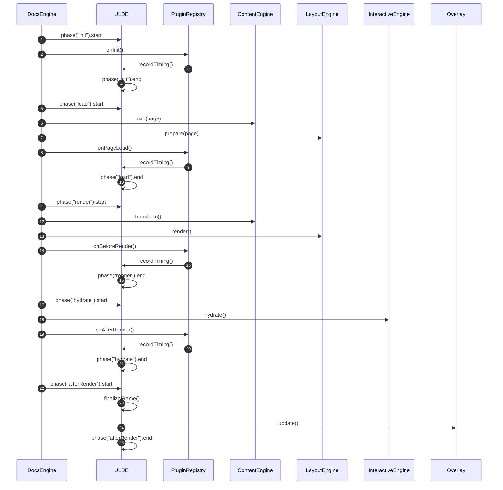

# The Unified Lifecycle Diagram

This is the backbone of your entire documentation system + ULDE integration, and once we lock this down, every plugin, overlay, and rendering pipeline will fall neatly into place.

Because you thrive on explicit, layered, visual documentation, I’ll give you a clean, modular, contributor‑friendly lifecycle model that can be turned into:

- a sequence diagram
- a timeline diagram
- a cheat sheet
- a plugin onboarding reference

Let’s build the conceptual model first, then refine it visually.

🌐 Unified Documentation + ULDE Lifecycle
---

This is the canonical lifecycle that every page load, navigation, and render will follow.

## 1. High‑Level Phases

1. These are the five phases that define the entire system:
2. init — system boot, registry setup
3. load — fetch page data, metadata, content
4. render — transform + layout + compile
5. hydrate — activate interactive components
6. afterRender — finalize, measure, cleanup

ULDE observes all of them.

## 2. Unified Lifecycle Sequence (Textual Form)

This is the exact sequence you’ll use for your diagrams:
```
DocsEngine.start()
  → ULDE.phase("init").start
    → DocsEngine.onInitDocs()
      → PluginRegistry.initAll()
      → ULDE.recordPluginTimings()
  → ULDE.phase("init").end

DocsEngine.navigateTo(page)
  → ULDE.phase("load").start
    → DocsEngine.onLoadPage(page)
      → ContentEngine.load(page)
      → LayoutEngine.prepare(page)
      → PluginRegistry.onPageLoad()
      → ULDE.recordPluginTimings()
  → ULDE.phase("load").end

DocsEngine.render(page)
  → ULDE.phase("render").start
    → ContentEngine.transform()
    → LayoutEngine.render()
    → PluginRegistry.onBeforeRender()
    → ULDE.recordPluginTimings()
  → ULDE.phase("render").end

DocsEngine.hydrate(page)
  → ULDE.phase("hydrate").start
    → InteractiveEngine.hydrate()
    → PluginRegistry.onAfterRender()
    → ULDE.recordPluginTimings()
  → ULDE.phase("hydrate").end

DocsEngine.complete()
  → ULDE.phase("afterRender").start
    → ULDE.finalizeFrame()
    → ULDE.emitOverlayUpdate()
  → ULDE.phase("afterRender").end

```
Sequence Diagram (Mermaid‑ready):



## 3. Layered Lifecycle (Contributor‑Friendly View)

This is the version that will appear in onboarding docs.

Docs Engine Lifecycle

- init
- load
- render
- hydrate
- afterRender

Plugin Lifecycle Hooks

- onInit
- onPageLoad
- onBeforeRender
- onAfterRender
- onDestroy

ULDE Observability Lifecycle

- phase start
- plugin timing start
- plugin timing end
- phase end
- frame finalize
- overlay update

Everything is synchronized.

## 4. Timeline Diagram (Conceptual)

__Here’s the timeline structure you’ll turn into a visual artifact:__
```
|---------------- init ----------------|
|----------- load -----------|
|--------------------- render ---------------------|
|---------- hydrate ----------|
|-- afterRender --|

Within each:
  [plugin A] [plugin B] [plugin C]
  timings recorded by ULDE

```

__Mermaid Gantt version (drop‑in ready):__

```mermaid
gantt
    dateFormat  X
    axisFormat  %L

    section init
    init phase           :a1, 0, 20

    section load
    load content         :a2, 20, 20
    load layout          :a3, 40, 20
    load plugins         :a4, 60, 20

    section render
    transform content    :a5, 80, 20
    render layout        :a6, 100, 20
    plugins beforeRender :a7, 120, 20

    section hydrate
    hydrate interactive  :a8, 140, 20
    plugins afterRender  :a9, 160, 20

    section afterRender
    finalize frame       :a10, 180, 10
    overlay update       :a11, 190, 10

```


__Phase‑Plugin Matrix (Contributor Cheat Sheet):__

This is the single most useful onboarding artifact for plugin authors.

Phase	|Docs Engine Action	|Plugin Hook	|ULDE Action
------|-------------------|-------------|------------
init	|System boot	|onInit	|Start phase, record timings
load	|Load content + layout	|onPageLoad	|Record plugin timings
render	|Transform + layout render	|onBeforeRender	|Record plugin timings
hydrate	|Activate interactive blocks	|onAfterRender	|Record plugin timings
afterRender	|Finalize + overlay	|(none)	|Finalize frame, update overlay

This matrix becomes a debug overlay legend, a plugin author reference, and a lifecycle contract.

__Debug Overlay Mapping (How ULDE Visualizes It):__
This ties the diagrams directly to your overlay UI.

Overlay Element	|Lifecycle Source
Phase bars	|ULDE.phase start/end
Plugin bars	|ULDE.recordPluginTimings
Frame sparkline	|ULDE.finalizeFrame
Heatmap colors	|Phase duration thresholds
Plugin list	|PluginRegistry execution timings
Warnings	|ULDE anomaly detection

This ensures your visual profiler matches the lifecycle exactly.

__Optional: Excalidraw‑style Sketch (Textual Layout):__
```
+-------------------------------------------------------------+
|                         ULDE Overlay                        |
|-------------------------------------------------------------|
| init | load | render | hydrate | afterRender                |
|-------------------------------------------------------------|
| [plugin A][plugin B][plugin C]  (timings per phase)         |
|-------------------------------------------------------------|
| Sparkline: |▁▂▃▅▆█▆▅▃▂▁|  (frame history)                 |
|-------------------------------------------------------------|
| Plugin Table:                                               |
|  • plugin-a   1.2ms   12%   ●color                          |
|  • plugin-b   0.4ms    4%   ●color                          |
|-------------------------------------------------------------|
+-------------------------------------------------------------+
```

This is the visual mental model contributors will instantly understand.


This is the basis for your scrolling frame-history sparkline and plugin execution bars.

## 5. Namespaced Lifecycle Model

Because you enforce namespacing conventions, here’s the clean version:

docs.init.*

- docs.init.start
- docs.init.plugins
- docs.init.end

docs.load.*

- docs.load.start
- docs.load.content
- docs.load.layout
- docs.load.plugins
- docs.load.end

docs.render.*

- docs.render.start
- docs.render.transform
- docs.render.layout
- docs.render.plugins
- docs.render.end

docs.hydrate.*

- docs.hydrate.start
- docs.hydrate.interactive
- docs.hydrate.plugins
- docs.hydrate.end

docs.afterRender.*

- docs.afterRender.start
- docs.afterRender.finalize
- docs.afterRender.overlay
- docs.afterRender.end

This gives you a stable event taxonomy for plugins, overlays, and debugging.

## 6. Ready‑to‑Draw Sequence Diagram

Here’s the exact structure you can drop into a diagramming tool:
```
DocsEngine → ULDE: phase("init").start
DocsEngine → PluginRegistry: onInit()
PluginRegistry → ULDE: recordTiming()
ULDE → ULDE: phase("init").end

DocsEngine → ULDE: phase("load").start
DocsEngine → ContentEngine: load()
DocsEngine → LayoutEngine: prepare()
DocsEngine → PluginRegistry: onPageLoad()
PluginRegistry → ULDE: recordTiming()
ULDE → ULDE: phase("load").end

DocsEngine → ULDE: phase("render").start
DocsEngine → ContentEngine: transform()
DocsEngine → LayoutEngine: render()
DocsEngine → PluginRegistry: onBeforeRender()
PluginRegistry → ULDE: recordTiming()
ULDE → ULDE: phase("render").end

DocsEngine → ULDE: phase("hydrate").start
DocsEngine → InteractiveEngine: hydrate()
DocsEngine → PluginRegistry: onAfterRender()
PluginRegistry → ULDE: recordTiming()
ULDE → ULDE: phase("hydrate").end

DocsEngine → ULDE: phase("afterRender").start
ULDE → ULDE: finalizeFrame()
ULDE → Overlay: update()
ULDE → ULDE: phase("afterRender").end
```

This is the canonical sequence for your system.

