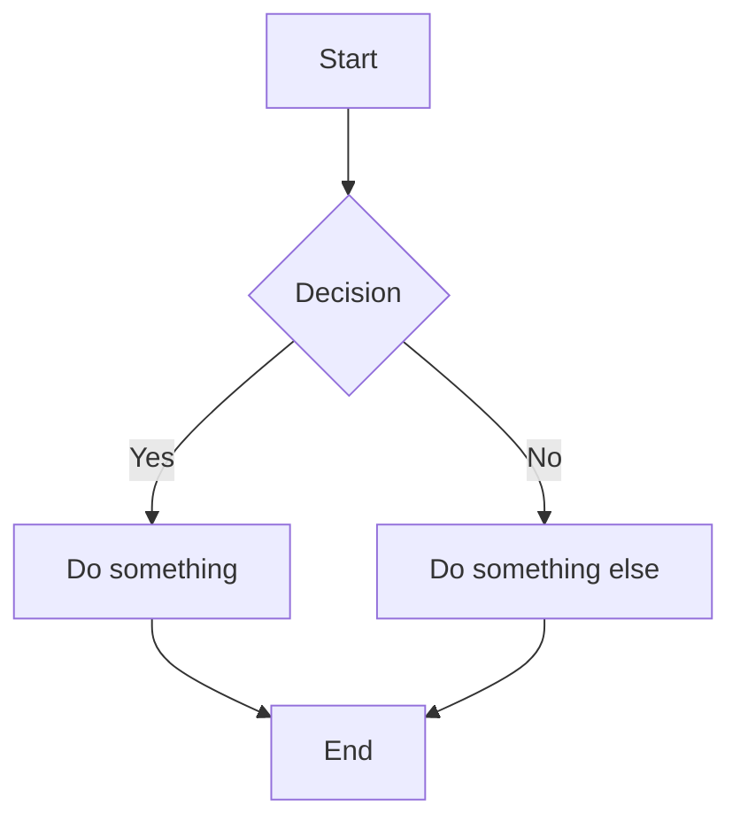

# Add a Mermaid Rendering Plugin

Below is the complete Mermaid plugin, fully aligned with:

- your ULDE plugin architecture
- your naming conventions
- Angular v21 SSR constraints
- your existing UldeViewer browser‑check
- your preference for clean layering (Mermaid stays out of Angular)

This plugin will:

- detect Mermaid code blocks
- convert them into &lt;div class="mermaid">…&lt;/div>
- load Mermaid only in the browser
- render diagrams after ULDE finishes
- avoid SSR issues
- integrate cleanly into the ULDE lifecycle

## 1. Mermaid = DOM‑based renderer (post‑DOM phase)

### architectural clarity

__Layer 1 — ULDE (string world)__

- markdown-it → HTML
- plugins → transform HTML
- no DOM access
- no Mermaid rendering

__Layer 2 — Angular (DOM world)__

- sanitizes or trusts HTML
- inserts HTML into DOM
- triggers effects on DOM updates

__Layer 3 — Mermaid (post-DOM world)__

- scans real DOM
- renders diagrams
- injects SVG

So that,
Mermaid:

- scans the real DOM (document.querySelectorAll)
- replaces elements with SVG
- cannot run on strings
- cannot run inside ULDE
- must run after Angular inserts HTML

So Mermaid belongs in:

__✔ Angular effect()__
__✔ Angular directive__
__❌ NOT inside ULDE__

## 2. Install Mermaid
```
npm install mermaid
```

## 3. Create the Mermaid Plugin

Create:
```
src/app/ulde/plugin-system/plugins/mermaid/mermaid.plugin.ts
```
__mermaid.plugin.ts__
```ts
import { UldePlugin } from '../../registry/plugin-registry';

export const MermaidPlugin: UldePlugin = {
  name: 'mermaid',
  phase: 'interactive',
  async run(ctx) {
    ctx.html = ctx.html.replace(
      /<pre><code class="language-mermaid">([\s\S]*?)<\/code><\/pre>/g,
      (match, code) => {
        const decoded = code
          .replace(/&lt;/g, '<')
          .replace(/&gt;/g, '>')
          .replace(/&amp;/g, '&');

        return `<div class="mermaid">${decoded.trim()}</div>`;
      }
    );
  }
};

```

## 4. Angular side: run Mermaid after DOM updates.

__ulde-viewer.ts (core parts):__
```ts
import { Component, signal, Inject, inject, AfterViewInit, OnDestroy, PLATFORM_ID, effect,  } from '@angular/core';
import { isPlatformBrowser } from '@angular/common';
import { DomSanitizer, SafeHtml } from '@angular/platform-browser';
import mermaid from 'mermaid';
import { Ulde } from '../../core/ulde/ulde';
import { UldeLayoutShell } from '../ulde-layout-shell/ulde-layout-shell';

@Component({
  selector: 'ulde-viewer',
  imports: [UldeLayoutShell],
  templateUrl: './ulde-viewer.html',
  styleUrls: ['./ulde-viewer.scss'],
  standalone: true
})
export class UldeViewer implements AfterViewInit, OnDestroy {
  html = signal<SafeHtml | string>('');
  private ulde = inject(Ulde);
  private sanitizer = inject(DomSanitizer);
  private $isBrowser = signal<boolean>(false);

  private stopEffect?: EffectRef;

  constructor(@Inject(PLATFORM_ID) platformId: Object) {
    this.$isBrowser.set(isPlatformBrowser(platformId));

    // react to html() changes and run Mermaid after DOM updates
    this.stopEffect = effect(() => {
      if (!this.$isBrowser()) return;
      const current = this.html();
      if (!current) return;

      queueMicrotask(async () => {
        try {
          mermaid.initialize({ startOnLoad: false });
          await mermaid.run({ querySelector: '.mermaid' });
        } catch (err) {
          console.error('[UldeViewer] Mermaid render error:', err);
        }
      });
    });
  }

  ngAfterViewInit(): void {
    if (!this.$isBrowser()) return;
    this.load('index.md');
  }

  ngOnDestroy(): void {
    this.stopEffect?.destroy();
  }

  async load(path: string) {
    const ctx = await this.ulde.render(path);
    const safe = this.sanitizer.bypassSecurityTrustHtml(ctx.html);
    this.html.set(safe);
  }
}

```

__ulde-layout-shell.ts:__
```ts
import { Component, input } from '@angular/core';
import { SafeHtml } from '@angular/platform-browser';

@Component({
  selector: 'app-ulde-layout-shell',
  imports: [],
  templateUrl: './ulde-layout-shell.html',
  styleUrl: './ulde-layout-shell.scss',
})
export class UldeLayoutShell {
  html = input<SafeHtml|string>('');
}

```

__Why this works__

- Phase = interactive  
Mermaid must run after layout and content are in the DOM.
- SSR‑safe  
typeof window === 'undefined' prevents server execution.
- Idempotent  
Mermaid can be initialized multiple times safely.
- Plugin‑extensible  
This plugin is fully isolated from Angular.

## 3. Register the Plugin in Ulde

In:
```
src/app/ulde/core/ulde/ulde.ts
```

Add:
```ts
import { MermaidPlugin } from '../../plugin-system/plugins/mermaid/mermaid.plugin';
```

Then in the constructor:
```ts
constructor() {
  this.plugins.register(HeadingAnchorsPlugin);
  this.plugins.register(TimingPlugin);
  this.plugins.register(MermaidPlugin);
}
```

## 4. Add Mermaid Styles (Optional but Recommended)

Add:
```scss
.mermaid {
  margin: 1.5rem 0;
}
```

Mermaid injects its own SVG styles, so this is enough.


## 5. Test It

Create a markdown file:
```
src/assets/docs/mermaid-test.md

Add:


Then load it:

http://localhost:4200/mermaid-test
```


You will see a rendered Mermaid diagram inside your layout shell.


