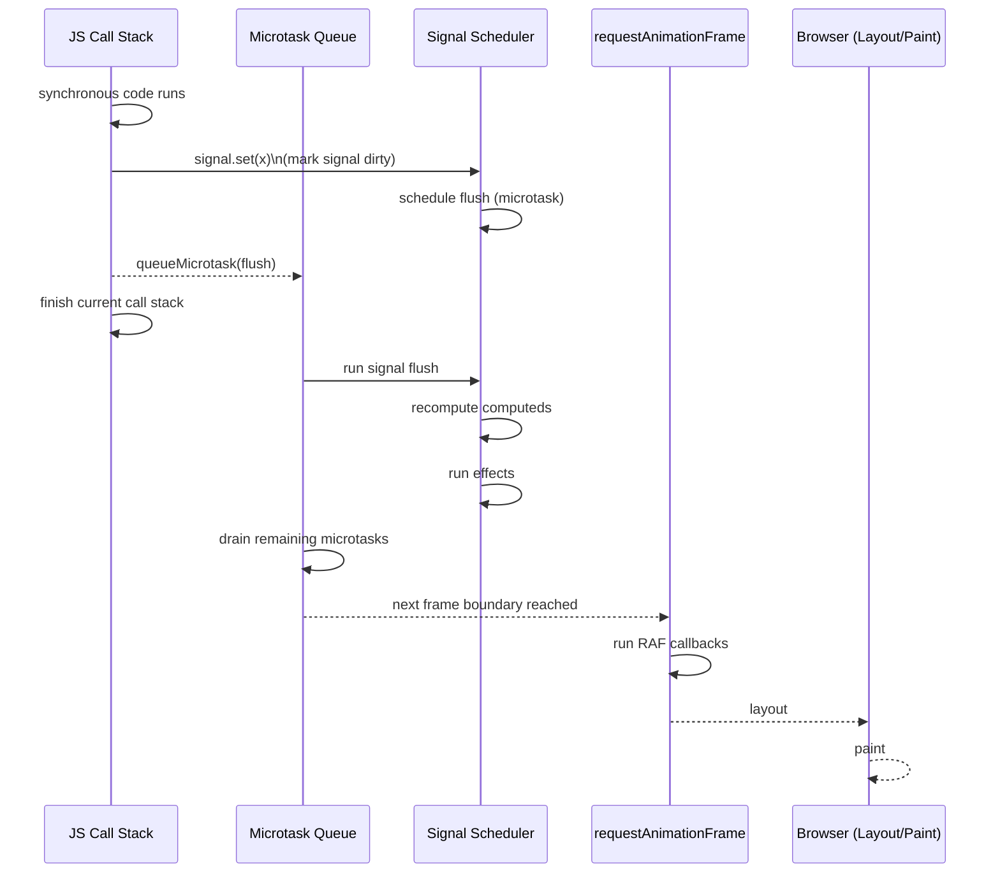
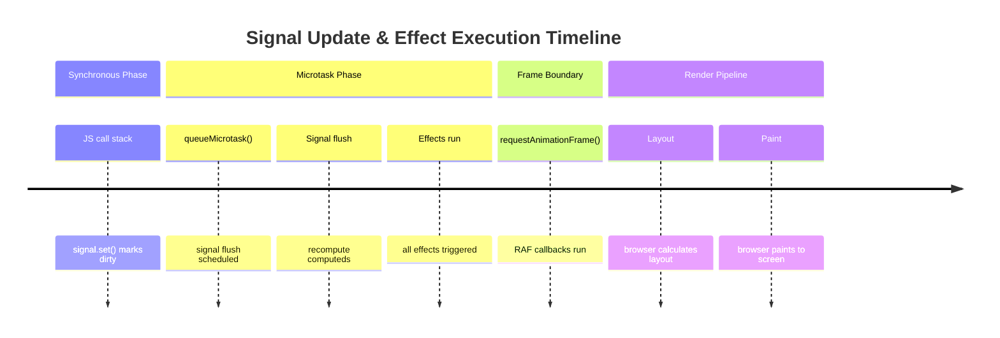

# queueMicrotask vs sgnal

## 1. Why ```queueMicrotask()``` feels like a signal update

Reactive systems (Angular Signals, SolidJS, Vue’s reactivity, Svelte’s flush cycle, React’s microtask batching) all share a pattern:

1. State changes synchronously
2. But effects/subscribers run later, after the current call stack
3. And they run before the browser paints

This is exactly the timing window where microtasks run.

So yes — microtasks are a natural place to schedule:

- effect flushes
- dependency graph updates
- computed value recalculations
- batching
- deduplication

This is why many frameworks use microtasks internally.

## 2. But here’s the key difference

```queueMicrotask()``` is a scheduling primitive.

It has no concept of:

- dependencies
- dirty checking
- batching
- deduplication
- graph propagation
- subscribers

It just says: _“Run this callback after the current JS stack, before anything else.”_

Signals are a reactive graph system.

They include:

- dependency tracking
- propagation
- effect scheduling
- deduplication
- batching
- circular dependency detection
- lazy evaluation
- memoization

Signals may use microtasks internally, but they are far more than microtasks.

## 2. Mechanically: how they differ

```queueMicrotask()```

Runs once, with no knowledge of state or dependencies.

```js
queueMicrotask(() => {
  console.log("flush");
});
```

Signals
Maintain a dependency graph and schedule updates intelligently.

```ts
const count = signal(0);
effect(() => console.log(count()));

count.set(1); // effect runs later (often via microtask)
```

The effect runs because:

- the signal tracks dependencies
- the effect is registered
- the scheduler batches updates
- the flush happens in a microtask

Microtasks are just the transport layer.

Signals are the reactive engine.

## 3. When they overlap

__Signals often use microtasks for:__

- batching updates
- avoiding reentrancy
- ensuring consistent state before effects run
- running effects before paint

This is why they feel similar.

But signals add:

- dependency tracking
- propagation
- memoization
- deduplication
- lifecycle management

Microtasks add none of that.

## 3. A helpful analogy

__Microtask = “run this later”__

A simple scheduling hook.

__Signal = “run this later because something changed”__

A full reactive system with rules, dependencies, and propagation.

## 4. A concrete example to show the difference

Using microtasks to simulate a tiny reactive system:

```js
let value = 0;
let pending = false;

function setValue(v) {
  value = v;
  if (!pending) {
    pending = true;
    queueMicrotask(() => {
      pending = false;
      console.log("value is", value);
    });
  }
}

setValue(1);
setValue(2);
setValue(3);
```

Output:

```Code
value is 3
```

This is manual batching.

Signals do this automatically — and much more.

## 5. Summary (the crisp version)
Concept	|queueMicrotask()	|Signals 
---------|-----------------|--------
Purpose	|Schedule ASAP after stack	|Reactive state system
Knows about dependencies	|❌ No	|✅ Yes
Batching	|❌ No	|✅ Yes
Deduplication	|❌ No	|✅ Yes
Propagation	|❌ No	|✅ Yes
Runs before paint	|Yes	|Usually (via microtasks)
Similarity	|Timing	|Timing + scheduling

__So yes — signals often use microtasks, but they are not microtasks.__

Microtasks are the timing mechanism.

Signals are the reactive architecture.

---
# Signal

## 1. Event Loop + Signal Flush (Mermaid Sequence Diagram)

This diagram shows how a signal update flows through the event loop, including:

- synchronous state mutation
- microtask scheduling
- effect flush
- RAF
- layout
- paint



This captures the actual ordering:

1. Signals mark themselves dirty synchronously
2. A microtask is scheduled
3. Effects run in the microtask phase
4. RAF runs later, before paint

## 2. Timeline Diagram — When Effects Run

This is a horizontal timeline showing exactly when effects fire relative to:

- synchronous JS
- microtasks
- RAF
- layout
- paint



This makes it visually obvious:

- Effects run before RAF
- Effects run before layout/paint

Effects run after the current JS stack

Effects run inside the microtask phase

## Why this matters architecturally

Signals guarantee:

- state is consistent before the browser renders
- effects never run reentrantly
- effects run in a deterministic phase
- DOM reads/writes inside effects happen before RAF

This is why signals feel “microtask-like” — they use microtasks as their flush boundary.

But signals add:

- dependency tracking
- batching
- deduplication
- propagation
- memoization

Microtasks are just the timing substrate.
