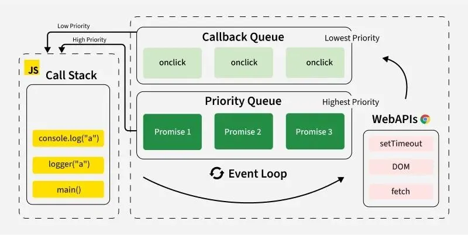

# Article 1. [Javascript’s queueMicrotask vs requestAnimationFrame](https://medium.com/@TheJsMaster/javascripts-queuemicrotask-vs-requestanimationframe-which-runs-first-and-why-a043182cc098)


As a wise man once said, “Learn by asking questions”.

Here is a question, what’s the order of console logs here ?

```js
const p = new Promise((r)=>{r(); console.log("in promise contructor")}); 

p.then(()=>console.log("in p's then")); 

queueMicrotask(()=>console.log("micro task")); 

Promise.resolve().then(()=>console.log("in then")); 

console.log("promise created");

requestAnimationFrame(()=>console.log("raf")); 

setTimeout(()=>{console.log("in timeout")}, 1000);
```

__Task Queues:__



we know that Javascript runtime has call Stack which contains set of instructions to execute. It goes through each instruction and executes it, and if that instruction adds more instructions to call stack then, It executes those also as it’s a stack before going to next instruction.

But there is also something called task queues (2 of them). one stores the micro tasks (which are more prioritised), another stores the macro tasks (which are often called Tasks) that are less prioritised over micro tasks.

__queueMicrotask:__

It lets you add a micro task to micro task queue. which gets executed once all the instructions in call stack are executed and call stack is emptied.

Promise’s then or catch callbacks are added to micro task queue.

```code
queueMicrotask(()=>console.log("micro task"));

Promise.resolve().then(()=>console.log("in then")); 
```

__requestAnimationFrame or setInterval or setTimeout or Dom events..etc:__

This is how you will add a macro task to queue. Some DOM apis take time to respond wether it’s api response or response from user or response needed from the operating system / browser. Once they respond, the responded will be added to task queue. So for example setTimeout ads the task to execute that call back function after the timeout value is run out. same with setInterval. Because we don’t know when they are supposed to be executed, they are always less prioritised over micro tasks.

```js
requestAnimationFrame(()=>console.log("raf"));

setTimeout(()=>{console.log("in timeout")}, 1000);
```

these tasks will be added to Task Queue once they are ready. Here requestAnimationFrame’s task probably will be ready before setTimtouts.

```new Promise(()=>console.log(“ in promise”))```

we also know that when we pass a function to a constructor function, we know that that function gets called immediately.

Which gets called first and why?

Here is the answer:
```js
in promise contructor
promise creted
in p's then
micro task
in then
raf
in timeout
```

1. Promise’s consturctor function will be called immediately and prints “in promise constructor”

2. Then it schedules a micro task to print “in p’s then”. then it schedules another micro task to print “micro task”. then another to print “in then”.

3. Then it prints “promise created” as it’s part of call stack.

4. Then it schedules a macro task to print ‘raf’ when the requestAntimationFrame api responds.

5. Then it schedules a timer to print ‘in timeout’

Then the call stack gets emptied as all instructors are done executing.

now, all microtasks added to micro task queue in step 2, are moved to call stack and prints “in p’s then”, “micro task”, “in then”

Call Stack is emptied now.

Request Animation Frame api responds now. so it will print “raf”
then, the timer’s call back will be called printing “in timeout”

The End…


----

# Article 2. [Mastering JavaScript Memory: A Beginner’s Guide to Stack and Heap](https://dev.to/chintanonweb/mastering-javascript-memory-a-beginners-guide-to-stack-and-heap-57nj)

## 1. JavaScript Stack and Heap Memory Explained: Understanding Primitives and Non-Primitives in Depth

In the world of JavaScript, handling memory efficiently is crucial for creating optimal applications. JavaScript uses two types of memory spaces: the stack and the heap. In this article, we’ll cover how these memory spaces function, especially when working with primitive and non-primitive data types. By the end of this guide, you'll be able to identify where your data lives and how it impacts performance.

__Introduction__
JavaScript is a memory-managed language, meaning it abstracts away the complexity of memory allocation and deallocation. However, understanding how memory works internally can help developers write efficient code and avoid memory-related issues. Memory is managed in two main areas:

__Stack Memory:__ The memory space for static data.
__Heap Memory:__ The memory space for dynamic data.
The type of data you work with—primitive or non-primitive—also influences where and how it’s stored. Let’s explore these concepts in detail.

## 2. Stack Memory in JavaScript What Is Stack Memory?

Stack memory is a linear data structure that stores variables in a “last in, first out” (LIFO) order. It holds fixed-size data and is faster to access than heap memory. The stack is mainly used for primitives and local variables.

__Primitives and the Stack__
JavaScript primitive types (like numbers, strings, booleans, undefined, null, and symbols) are stored in the stack because they are fixed-size data. This makes them easy to manage, as the JavaScript engine knows how much memory they occupy.

Example: How Primitives Are Stored in the Stack
```code 
let a = 10; // Stored in stack
let b = a;  // Also stored in stack as a copy of 'a'

a = 20;     // Changing 'a' does not affect 'b'

console.log(a); // Outputs: 20
console.log(b); // Outputs: 10
```
In this example, a and b are two separate copies in stack memory. Changing one does not affect the other because they are stored as separate entities.

__Why Use the Stack?__
The stack is efficient for short-lived, fixed-size data. It’s organized and faster for accessing primitive data, making it ideal for storing simple variables that don’t need dynamic memory.

## 3. Heap Memory in JavaScript What Is Heap Memory?

Heap memory is a larger, less structured memory space used for storing data that needs to grow dynamically or isn’t fixed in size. It stores non-primitive data types, which includes objects, arrays, and functions. Heap memory allows the creation of complex data structures but is slower to access than stack memory.

__Non-Primitives and the Heap__
Non-primitive data types in JavaScript are stored in the heap. These types include objects and arrays, which are dynamic in nature. When you assign a non-primitive to a variable, JavaScript creates a reference to the location in the heap rather than storing the data itself on the stack.

Example: How Non-Primitives Are Stored in the Heap
```js
let obj1 = { name: "Alice" }; // Stored in heap
let obj2 = obj1;               // Both 'obj1' and 'obj2' point to the same location in heap

obj1.name = "Bob";             // Modifying obj1 will affect obj2

console.log(obj1.name); // Outputs: "Bob"
console.log(obj2.name); // Outputs: "Bob"
```
In this case, both obj1 and obj2 refer to the same memory location in the heap. Changing one affects the other since they are references to the same object.

__Why Use the Heap?__
Heap memory is essential for non-primitive data types because it allows for flexibility and dynamic memory allocation. This flexibility is crucial for complex data structures like arrays and objects that can change size or hold various properties.

## 4. Deep Dive: Differences Between Stack and Heap Memory

Feature	|Stack Memory	|Heap Memory
--------|-------------|-----------
Data Type	|Primitives	|Non-primitives (objects, arrays)
Structure	|Fixed-size, LIFO	|Dynamic, less structured
Speed	|Fast	|Slower due to dynamic nature
Memory Limit	|Limited	|Large, but prone to fragmentation
Memory Cleanup	|Automatic (by scope)	|Garbage collection required

__Garbage Collection and the Heap__
JavaScript’s garbage collector periodically clears unreferenced objects in the heap to free up memory. This process, known as garbage collection, helps maintain efficient memory usage.

## 5. Working with Primitives vs. Non-Primitives: Examples and Scenarios

__Scenario 1: Copying Primitives__
```js
let x = 5;
let y = x; // Creates a copy of 'x' in stack

x = 10;

console.log(x); // Outputs: 10
console.log(y); // Outputs: 5
```
In this scenario, y remains unaffected by changes to x because they are stored separately in the stack.

__Scenario 2: Copying Non-Primitives (References)__
```js
let array1 = [1, 2, 3];
let array2 = array1; // Points to the same memory location in heap

array1.push(4);

console.log(array1); // Outputs: [1, 2, 3, 4]
console.log(array2); // Outputs: [1, 2, 3, 4]
```
In this case, both array1 and array2 refer to the same array in the heap. Modifying array1 affects array2.

__Scenario 3: Cloning Non-Primitives to Avoid Reference Issues__
To prevent references from affecting each other, you can create a shallow copy or a deep copy of the object.

Shallow Copy Example:
```js
let originalArray = [1, 2, 3];
let shallowCopy = [...originalArray]; // Creates a new array in heap

originalArray.push(4);

console.log(originalArray); // Outputs: [1, 2, 3, 4]
console.log(shallowCopy);   // Outputs: [1, 2, 3]
```

Deep Copy Example:
or deep cloning, especially with nested objects, you can use JSON.parse and JSON.stringify or a library like Lodash.
```js
let originalObject = { name: "Alice", address: { city: "Wonderland" } };
let deepCopy = JSON.parse(JSON.stringify(originalObject));

originalObject.address.city = "New Wonderland";

console.log(originalObject.address.city); // Outputs: "New Wonderland"
console.log(deepCopy.address.city);     
```

## 6. FAQ: Common Questions About Stack and Heap Memory in JavaScript

__Q: Why does JavaScript differentiate between stack and heap memory?__

A: JavaScript optimizes memory usage by keeping small, fixed-size data in the stack and complex, dynamic data in the heap. This distinction helps the JavaScript engine manage resources efficiently.

__Q: When should I use deep copies vs. shallow copies?__

A: Use deep copies for nested or complex objects where you want full independence from the original object. Shallow copies work for simple cases where you don’t need deep cloning.

__Q: Can I force JavaScript to release memory?__

A: While you can’t directly force memory release, you can minimize memory leaks by ensuring objects are no longer referenced once they’re no longer needed.

__Q: How can I avoid memory leaks in JavaScript?__

A: Avoid global variables, use closures carefully, and make sure to nullify references to large objects when they’re no longer in use.

## Conclusion

Understanding JavaScript’s stack and heap memory and how primitive and non-primitive data types interact with these spaces can vastly improve your coding efficiency and performance. The stack is perfect for quick, short-lived data, while the heap allows dynamic, long-lived data structures to thrive. By mastering these memory concepts, you’ll be better equipped to handle memory management, reduce bugs, and build optimized applications.


# Article 3. [How JavaScript Works Behind the Scenes: A Visual Step-by-Step Guide to the Engine (2025)](https://www.deepintodev.com/blog/how-javascript-works-behind-the-scenes)

April 14, 2025
Last updated at: December 12, 

After you complete this article, you will have a solid understanding of:

- How JavaScript executes code in a single thread
- What the Call Stack is and how it manages execution
- How Web APIs help with asynchronous operations
- The difference between Task Queue and Microtask Queue
- How the Event Loop coordinates all these components

As we all know JavaScript runs on just one thread, so it can only do one thing at a time. But somehow it handles many things at once. How does that work? It's like trying to text friends, make coffee, and watch Instagram reels, all with just one hand. If you've ever asked yourself how JavaScript does so many things without freezing even though it's __single__ threaded, you're not alone. So let’s take a closer look at how this actually happens behind the scenes, and how the __JS engine__ manages to pull off this kind of ‘multi-tasking’.

Let's do it step by step. First of all, JavaScript is not a "compiled" language so it doesn't directly translate to machine code like C, C++, or Go. We have to take the JavaScript file as an input, and we have to put it in some kind of machine that can understand that file and "interprets" it to machine code. As you probably know, that's what "interpreted languages" means. There are some upsides and downsides of being an interpreted language, but I'm not going into so much detail here so we don't get lost.

Some kind of machine in this context will be __V8 Engine__ which Google Chrome or NodeJS uses (there are some other engines that can do the same job too). So basically, V8 Engine is a runtime that can take a JavaScript file as input and turn it into something computers can understand.

But like we said at the beginning, it runs on one thread. Why is that though?

So, this engine has mainly 2 parts __called Heap__, and __Call Stack__.

__Heap__ part is the memory area where objects and variables are stored. Reference types (objects, arrays, functions etc.) are also stored in the heap. So this part is mainly for storage. Not to get too confused, let's forget this part for right now and let's focus on why JavaScript runs only on one thread.

The __Call Stack__, on the other hand, is the part that manages the execution of our program, and it’s also what makes JavaScript single-threaded. Let’s walk through a code example, step by step.

Let's say we have the following code to run;
```js
console.log("First");
console.log("Second");
```

For the first console.log function, something called execution context is created(you can nevermind it for right now), pushed into the call stack, logged in the console then popped out from the call stack. For the second console.log it's the same story. A new execution context is created, pushed into the call stack, logged in the console and popped out from the call stack... Just like we said, everything happens one by one in the call stack. Single task at a time!

> __Note:__ For functions, the execution context means that every time a function is called, a new environment is created to handle that specific call. This environment stores: the function's local variables, arguments passed to the function, the value of the this keyword (basically, what this keyword points to in that context), and a reference to its outer (parent) scope for closure access. So basically, each function call runs in its own little ‘box’ with its own data. And we call that box the execution context to make it sound a bit cooler.

But what if we don’t just have simple console.logs, but some heavy operations going on? For example:
```js
function veryHeavyOperation() {
  for (let i = 0; i < 100_000_000_000; i++) {
    console.log(
      "there’s some heavy operation happening at the moment… can you be quiet?"
    );
  }
}
function veryImportantTask() {
  console.log("This is a very important console.log!");
}
veryHeavyOperation();
veryImportantTask();
```

Now, before our important task works, we have to wait for the call stack to be available. Because there’s a really huge for loop, and it just doesn’t finish. In the meantime, our program is completely frozen. The reason? like we said 100 times-sorry but I think I'll probably keep saying it...-, __javascript is single threaded__.

But this is not actually what we want. In real world applications, we often do network requests, handle files operations, we wait for user inputs, we wait for timers and so on... We definitely can't block our call stack for all these operations.

To solve these problems, we use some tools.

First of these tools are __WEB APIs__. Web APIs provide us some functions to allow us to interact with browser's features. (features like ```fetch, setTimeout, console, Geolocation, HTMLElement, URL```...)

So our browser works very hard in the back scenes. It does rendering, it does our network services, and also it provides us an interface to allow us to access some of its other features. But what makes these WEB APIs useful for long running tasks? Some of the __WEB APIs allow us to off-load long running tasks to the browser__.

For example, let's use one of the web api's to see what really happens.
```js
navigator.geolocation.getCurrentPosition(
  (position) => console.log(position),
  (error) => console.error(error)
);
```
Geolocation api allows the user to provide their location to web applications. First callback function that is passed to it means getting the location was successful. Other callback means some error happened during the process.

When the function is called, getCurrentPosition invocation is added to the call stack. But this is just to register those callback functions that we passed as parameters, and initiate that async task. After doing that, it will be popped out from the call stack. So it doesn't block the call stack. See below:


In the background, browser will start some kind of process and will ask the user for their location;


Well, we don't really know when user wants to allow. But that's not a problem. Since our function is not in call stack anymore, any other functions can still keep working in the call stack.

When, finally user clicks to allow, our API receives the data from browser, and uses the success callback to handle this result.

But, it can't just push that success function into the call stack. We don't know what's really happening in the call stack at this moment. It might interrupt some other process that are happening and it might cause some weird bugs. That's where other players come into play. Let's introduce __Task Queue__, also known as __Callback queue__. __This queue holds web api callbacks and event handlers to be able to get executed at some point in the future__. When is this future? Whenever call stack is available!

But how can we know when will call stack will be available? And now, to solve this problem, even another player comes into screen. And it's __Event Loop__([see ref01](https://www.javascripttutorial.net/javascript-event-loop/), [see ref02](https://javascript.info/event-loop)). As the name says, it's a loop that checks the call stack continuously to see if it's available. If call stack is available, event loop will take the first available task from the task queue and moves it to the call stack. See below image;


Now, before we dive into the event loop, let's do another example. There is another very popular callback-based Web API called setTimeout(), which you might have heard of.

```setTimeout()``` function will get a callback, and a timeout.
```js
setTimeout(() => console.log("This will run after 1000 milliseconds"), 1000);
```
Let's say we have a code like this;
```js
setTimeout(() => {
  console.log("1000ms");
}, 1000);
setTimeout(() => {
  console.log("2000ms");
}, 2000);
console.log("DeepIntoDev");
```

Just like we've seen before, first, setTimeout function will be added to the call stack. But this will only be to register that timeout (with its delay time). After registering the timeout, it will be popped out from the call stack. Same story, second timeout is going to be registered too. Now __they are on the Web APIs side__. They get registered and left the call stack.

Then, our console.log("DeepIntoDev") will go into the call stack. There is nothing asynchronous here, so it will just print DeepIntoDev to the console. After, it will be popped out from the callstack. Now, our final state looks like this;


And our console looks like this at the moment;
```code
DeepIntoDev
```

After 1000ms has passed, browser will say "Hey, 1000ms has passed", so the callback function which has 1000ms delay, __will be moved to Task Queue__;


Since there is nothing going on in the call stack right now, event loop will take that function and put it into call stack. After 2000ms has passed, same story will happen.

But there is something really important that you need to be aware of. 1000 ms delay that we gave our function, is actually the delay of taking the function from web apis to task queue. It's not the delay that it will be executed on the call stack! So if call stack were busy, that function would have to wait. __That means it was gonna be executed at a later point even after 1000ms has passed!__

After ~2000ms has passed, our console will be like this;

```code
DeepIntoDev
1000ms
2000ms
```

These examples we've seen until now were __Callback-based APIs__. There is also another approach to handling async operation in JavaScript and it's called __Promise-based APIs__. Callback-based APIs use functions passed as arguments that get executed after an asynchronous operation completes. On the other hand, promise-based APIs return Promise objects that represent future values. Here is an example for Promise-based API in JavaScript;

```js
function fetchData(url) {
  return new Promise((resolve, reject) => {
    // Simulating network request
    setTimeout(() => {
      if (url === "invalid") {
        reject(new Error("Failed to fetch data"));
      } else {
        resolve({ data: "Success" });
      }
    }, 1000);
  });
}

// Then/catch approach
fetchData("example.com")
  .then((result) => console.log("Result:", result))
  .catch((error) => console.error("Error:", error));

// Async/await approach
async function getData() {
  try {
    const result = await fetchData("example.com");
    console.log("Result:", result);
  } catch (error) {
    console.error("Error:", error);
  }
}
```

We generally use promises for complex asynchronous flows, modern JavaScript applications, and better readability.

> Note: If you're curious and if you want to learn how Promises work behind the scenes in JavaScript, [you can take a look at this 10-minute blog about how Promises work in JavaScript](https://www.deepintodev.com/blog/how-promises-work-in-javascript)

But what differences happen in the back-scene when we use promise-based apis instead of callback-based apis?

Whenever we work with promises, we're working with __Microtask queue__. So now, we've added 1 more tool to handle our async operation. Our final "components" look like this now;


Microtask queue is a special queue that is dedicated to; ```.then```, ```.catch```, ```.finally``` callbacks and for async-await. Only these will get pushed into microtask queue. (There are also some other functions like queueMicrotask, new mutationObserver.)

There is something really important that you should know here. __Event loop prioritizes Microtask Queue!__ So event loop will first look at the Microtask queue, if call stack is available, it will take those functions into the call stack. Only after when Microtask queue is empty, it will go and check the task queue.

More on that, event loop will check microtask queue after every event in the task queue! So when micro task queue is empty, it goes to task queue. It completes 1 task, and goes back to micro task queue. If it's empty then it goes to other task in task queue. __Event loop will repeat this until both task queue and microtask queue are empty__.

The most popular promised-based WEB API is fetch. As you already might know, the Fetch API is a modern JavaScript interface for making HTTP requests to servers. So let's do an example with using it.

```js
fetch("https://mybackendserver.com/api/users/...").then((res) =>
  console.log(res)
);

console.log("DeepIntoDev");
```

After we run the code above, fetch() function will be added to the callstack. But this is just to create the __Promise Object__. So function won't be executed but just registered to WEB APIs part, just like we saw at the callback-based apis. After, .then function will be added to the callstack, but this is just to register too. We will register a record so that we know what we do after our promise is resolved. (PromiseReaction)

> Note: I know I already said it, but if you want to learn about this Promise Object in detail, [you can check out this 10-minute blog post](https://www.deepintodev.com/blog/how-promises-work-in-javascript).

After ``fetch`` function is registered to the Web APIs, console.log("DeepIntoDev") will be added to the call stack and it will be executed right away since there is no asynchronous operation happening. Right now, our components look like this;


After we registered the promise object, browser will make a network request in the back scenes. Meantime, call stack is empty so we are not blocking any code that wants to go into call stack and get executed.

> __Note:__ If you're curious about how this request and communication happens between our browser and server from the other side of the world, I have a very cool blog about that — [How Data Travels the World to Reach Your Screen](https://www.deepintodev.com/blog/how-data-travels-the-world-to-reach-your-screen)

When finally server returned some data, our PromiseState which was "pending" state will turn to "fulfilled" and PromiseResult which was undefined will turn to __Response Object__ with the data that we got from the server. And finally, our PromiseReaction will be pushed to __Microtask Queue__. So the final state looks like this;


Since call stack is empty, the event loop will check the microtask queue and moves our function to call stack. Our function gets executed and it logs the result that we got from the server.

Now, let's do one final example and let's see if you got it right. Before you check the answer, try to solve it yourself first.

We have the following code;
```js
Promise.resolve().then(() => console.log(32));

setTimeout(() => console.log(9), 5);

queueMicrotask(() => {
  console.log(11);
  queueMicrotask(() => console.log(4));
});

console.log(3);
```

What will be the output?

The correct answer will be;
```code
3 32 11 4 9
```

First, we have ```Promise.resolve()```, this line will create a promise object but it will instantly be resolved. Since promise is already resolved, .then function will directly be pushed to microtask queue.

Then, ```setTimeout``` will initiate the timer and after 5 milliseconds have passed, callback function will be pushed to task queue.

Then, we have ```queueMicrotask``` which will push the function into microtask queue.

In the last line, we have ```console.log(3)``` so that function will directly go into call stack and be executed. So 3 will be logged to the console.

Our script is done and call stack is empty. Now event loop will check the microtask queue first. It will see the first function that is in the microtask queue is ```console.log(32)``` so 32 will be logged to the console.

Now, it goes to other function in the microtask queue which is ```queueMicrotask(()=>{ console.log(11); queueMicrotask(()=>console.log(4)) });``` this one. Now it will take this function to the call stack and will log 11 to the console. Then it sees another function that needs to be taken to the microtask queue. It takes ```()=>console.log(4)``` and pushes it to the microtask queue. Since microtask queue is still not empty, we will not go to task queue and first finish the microtask queue. That's why 4 will be printed on the screen.

Finally, our microtask queue is empty and now event loop can go to task queue to move that function to call stack. It will print 9 to the console.

Now, you have a solid understanding how javascript actually works behind the scenes.

In this blog, we've basically covered how the Event Loop orchestrates tasks across the Call Stack and other runtime components. However, it's important to realize that the commands we write like console.log don't simply land on the Stack as raw text, as you might assume... The V8 engine must first interpret and transform them into something the machine understands. To see how this translation from source code to executable bytecode actually happens, [you can check out this blog where we take a deep dive into how the V8 engine turns your human-readable code into something machines can actually use. - How V8 JavaScript Engine Transforms Your Code: From Human-Readable to Machine Code](https://www.deepintodev.com/blog/how-v8-javascript-engine-works-behind-the-scenes)

Was this blog helpful for you? If so,

