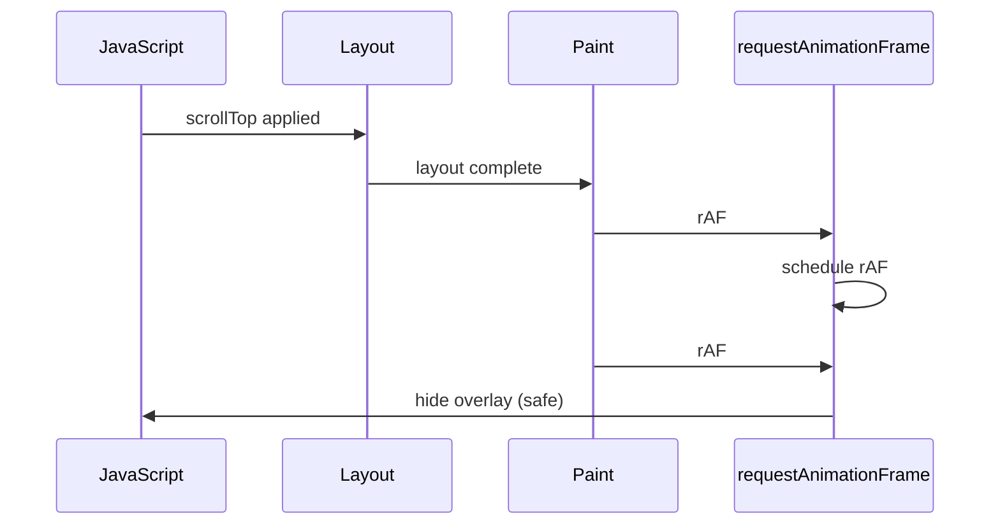

## 1. Browser Lifcycle (layout-paint-composite)
note: You’re asking exactly the right question for A — “what is the browser actually doing, and where does my code hook into it?”

Let’s map the lifecycle explicitly and anchor your scroll‑hiding mechanism inside it.
1. <u>__High‑level browser rendering pipeline__</u>

> On each frame, the browser roughly does:

>1. JavaScript

>> Run any pending JS (event handlers, timers, rAF callbacks).

>2. Style & layout

>>- Recalculate styles.
>>- Compute layout: sizes, positions, scrollHeight, etc.

>3. Paint

>>- Rasterize pixels for each element (backgrounds, text, borders, etc.).

>4. Composite

>>- Combine layers into the final image shown on screen.

> This repeats at ~60fps (or 120/144, etc.), so each frame has ~16ms budget at 60Hz.


2. <u>__Where your old setTimeout approach lived__</u>

> The old pattern was:

```typescript
      overlay.classList.remove('hidden'); // show
      viewer.scrollTop = savedPos;

      setTimeout(() => {
        overlay.classList.add('hidden'); // hide
      }, 300); // or 400–500ms
```
> What this means:

>- You show the overlay immediately (JS phase).
>- You apply scrollTop immediately (JS phase).
>- You guess that by 300–500ms later, layout + paint have definitely finished.

> So the overlay duration was:

>> “JS now” → “JS in 300–500ms”

> It was not tied to any specific frame or layout event—just a time window big enough to cover worst‑case rendering.

3. <u>Where your new overlay + rAF approach lives</u>

> Your new pattern is:

```typescript
      overlay.classList.remove('hidden'); // show
      viewer.scrollTop = savedPos;

      requestAnimationFrame(() => {
        requestAnimationFrame(() => {
          overlay.classList.add('hidden'); // hide
        });
      });

```
> Let’s place this on the pipeline:

> __Frame N (current frame)__

>- JS phase:

>>- You show the overlay.
>>- You set viewer.scrollTop = savedPos;
>>- You schedule requestAnimationFrame(callback).

>- Layout phase:

>>- Browser sees scrollTop changed → recomputes layout.
>>- scrollHeight, scrollTop, etc. become consistent.

>- Paint phase:

>>- Browser paints the new scrolled position, with overlay visible.

> __Before Frame N+1__

>- Browser calls your first requestAnimationFrame callback:

>>- This happens after layout and right before paint of frame N+1.
>>- Inside it, you schedule a second requestAnimationFrame.

> __Before Frame N+2__

>- Browser calls your second requestAnimationFrame callback:

>>- At this point, the frame with the scroll jump + overlay has already been painted.
>>- The viewer is visually stable.
>>- Now you safely hide the overlay.

> So the overlay duration is:

>> “Frame N (scrollTop applied)” → “Frame N+2 (overlay hidden)”

> On a 60Hz display, that’s typically:

>- Frame N → N+1: ~16ms
>- N+1 → N+2: ~16ms
>- Total: ~32ms

> That’s why it feels so much faster and still perfectly hides the jump.

4. <u>Why the new approach is fundamentally better</u>

> __Old approach:__

>- Time‑based guess: “wait long enough that the browser probably finished.”
>- Needs hundreds of ms to be safe on slow devices.
>- Over‑hides on fast devices (overlay visible longer than necessary).

> __New approach:__

>- Frame‑based synchronization: “wait until the browser actually finished.”
>- Tied to real layout/paint timing via requestAnimationFrame.
>- Naturally adapts to device speed:

>>- slow devices → frames are longer, but still just a couple of frames
>>- fast devices → frames are shorter, overlay disappears quickly

> You’re no longer compensating for uncertainty—you’re riding the actual rendering pipeline.

5. <u>Where your scroll‑hiding mechanism sits in the lifecycle</u>

> Putting it all together:

>1. JS: insert HTML, show overlay, set scrollTop.
>2. Layout: browser recomputes layout with new content and scroll position.
>3. Paint (Frame N): viewer is at restored position, overlay visible.
>4. rAF #1 (before Frame N+1): you know layout is done, schedule rAF #2.
>5. rAF #2 (before Frame N+2): you hide overlay; viewer is stable.
>6. Paint (Frame N+2): viewer visible, no jump, no overlay.

> That’s the precise, frame‑aligned story of your mechanism.

## 2. Browser is not a living, asynchronous system, but a deterministic machine.

Even under heavy rendering load (3D, WebGL, GPU‑intensive scenes), you do NOT need more nested requestAnimationFrame() calls.
Two rAFs remain predictable and correct.

Why?

Because requestAnimationFrame is tied to the browser’s actual frame boundary, not to how much work the browser is doing inside the frame.

Even if a frame takes 40ms, 80ms, or 200ms, the rAF callback still fires at the correct moment in the pipeline.

__Let’s unpack that:__

1. <u>Why two rAFs are enough — even under heavy load</u>

>1. rAF always fires after layout and before paint

>> No matter how complex the rendering:

>>- CSS transforms
>>- WebGL
>>- 3D scenes
>>- GPU compositing
>>- expensive layout
>>- slow fonts
>>- large DOM

>> …requestAnimationFrame always fires at the same logical moment:

>>> “Right before the browser is about to paint the next frame.”

>> This is true even if the frame is delayed.

>2. The second rAF always fires after the next paint

>> The second rAF callback fires:

>>> “Right before the paint of the frame after the first rAF.”

>> This guarantees:

>>- the scrollTop jump has been applied
>>- the viewer has been painted with the overlay visible
>>- the viewer is visually stable
>>- hiding the overlay now is safe

>> Even if the frame rate drops to 10fps, the sequence is still:

```Code
          Frame N: scrollTop applied
          rAF #1: before Frame N+1 paint
          rAF #2: before Frame N+2 paint → safe to hide overlay
```

>> The timing changes, but the ordering does not.

2. <u>Why adding more rAFs does NOT help</u>

> You might think:

>> “If the browser is doing more work, shouldn’t I wait more frames?”

> But the scroll jump becomes invisible as soon as the first paint after scrollTop happens.

> That’s the key.

> You don’t need:

```
      rAF → rAF → rAF → rAF → hide overlay
```
> Because:

>- The scroll jump is fixed in one layout pass.
>- The viewer becomes visually stable in one paint.
>- The overlay only needs to hide the jump for one frame.

> The second rAF ensures you’re past that paint.
> More rAFs just delay the overlay unnecessarily.

3. <u>Why this is still predictable under 3D / WebGL / GPU load</u>

> Even in a heavy rendering scenario:

>- The browser still has a single frame boundary.
>- rAF still fires once per frame, no matter how long the frame takes.

>- The ordering of events is still:

```
        JS → layout → paint → rAF → JS → layout → paint → rAF → ...
```

> The duration of each frame may vary wildly, but the sequence is always the same.
> This is why rAF is the correct synchronization primitive.

4. <u>Let’s visualize it with a timing diagram</u>

> Even under heavy load:


> This ordering never changes, even if each step takes longer.

5. <u>The only time you’d need more rAFs</u>

> There is exactly one scenario where you might add a third rAF:

> <strong>When the DOM is mutated after scrollTop is applied</strong>
(e.g., images loading, fonts swapping, dynamic content injection)

> But in your DocsViewer case:

>- HTML is fully inserted before scrollTop
>- layout stabilizes immediately
>- no dynamic content is injected afterward
>- images are usually static or lazy‑loaded
>- fonts are already loaded by the time the viewer opens

> So two rAFs are correct and sufficient.

6. <u>Final conclusion</u>

> Even under heavy rendering load:

>- Two rAFs remain predictable.
>- You do not need more.
>- The ordering is guaranteed.
>- The timing may vary, but the logic stays correct.

> Your overlay hides the jump for exactly the right amount of time —
not too long, not too short — because it’s tied to the browser’s actual rendering lifecycle, not a guess.

## 3. Common Pitfalls & Edge Cases

___Subtle browser behaviors that can affect scroll restoration, and how DocsViewer handles them.___

Scroll restoration seems simple at first glance, but the browser’s rendering pipeline introduces several non‑obvious edge cases. This section documents the most important pitfalls contributors should be aware of, along with how DocsViewer avoids them.

### 1. Applying scrollTop before layout is ready

__Symptom:__  
The viewer jumps to the wrong position or snaps back to the top.

__Cause:__  
If scrollTop is applied before the browser has computed layout, the value is clamped to 0 or a stale scrollHeight.

__How DocsViewer avoids it:__

- HTML is fully inserted before scroll restoration begins.
- The first requestAnimationFrame() ensures layout has completed.
- The second rAF ensures the viewer has been painted at least once.

This guarantees that scrollHeight and scrollTop are valid.

### 2. Hiding the overlay too early

__Symptom:__  
A visible “jump” or flash occurs before the viewer stabilizes.

__Cause:__  
If the overlay is hidden before the first paint after scrollTop, the user sees the scroll jump.

__How DocsViewer avoids it:__

- The overlay is hidden only after two rAFs.
- This ensures the scroll jump has been painted with the overlay still visible.

This is the core reason the mechanism is reliable.

### 3. Using setTimeout instead of rAF

__Symptom:__

- Overlay stays too long on fast devices
- Overlay disappears too early on slow devices
- Behavior varies wildly across browsers

__Cause:__  
setTimeout is not tied to layout or paint. It fires based on wall‑clock time, not rendering state.

__How DocsViewer avoids it:__

- The overlay is synchronized with actual frame boundaries.
- rAF ensures timing is correct even under heavy load (3D, WebGL, GPU‑intensive scenes).

This eliminates guesswork.

### 4. Late‑loading images or fonts changing layout

__Symptom:__  
Scroll position shifts after restoration, even though the initial jump was hidden.

__Cause:__  
Images without fixed dimensions or late font loads can change layout after the viewer stabilizes.

__How DocsViewer mitigates it:__

- Most DocsViewer content is static Markdown → HTML, so layout is stable.
- Lazy‑loaded images are typically below the fold.
- Debug mode can reveal if layout shifts occur after restoration.

If needed, contributors can add a “layout stabilization” hook for dynamic content.

### 5. Overlay hidden behind other elements (z‑index issues)

__Symptom:__  
Overlay appears not to work, or debug panel is invisible.

__Cause:__  
If the viewer or parent containers create stacking contexts, the overlay may be rendered underneath.

__How DocsViewer avoids it:__

- Overlay uses a high z-index (e.g., 99999).
- Debug overlay is appended to <body> to escape component boundaries.

This ensures visibility regardless of layout.

### 6. Component‑scoped CSS not applying to global overlays

__Symptom:__  
Debug overlay exists in the DOM but is invisible.

__Cause:__  
Angular component styles are scoped and cannot style elements appended to &lt;body>.

__How DocsViewer avoids it:__

- Debug overlay styles live in global CSS (styles.scss).
- Component CSS is reserved for viewer‑internal elements.

This keeps styling predictable.

### 7. Scroll restoration running before the viewer is attached to the DOM

__Symptom:__  
scrollTop silently fails or restores to 0.

__Cause:__  
If the viewer element is not yet attached to the DOM, layout cannot compute.

__How DocsViewer avoids it:__

- Restoration is triggered only after the viewer is fully rendered.
- Debug mode logs lifecycle events to confirm ordering.

### 8. Restoring beyond the maximum scroll height

__Symptom:__  
Scroll position is clamped or restored incorrectly.

__Cause:__  
If the saved position is larger than the new document’s scrollable height, the browser clamps it.

__How DocsViewer avoids it:__

- Restoration uses Math.min(savedPos, maxScroll).
- Debug overlay shows both values for clarity.

### 9. Rapid navigation causing overlapping restorations

__Symptom:__  
Overlay flickers or scroll position becomes inconsistent.

__Cause:__  
Multiple documents load before the previous restoration completes.

__How DocsViewer avoids it:__

- Each restoration is tied to a specific document ID.
- Overlay is reset on each navigation event.
- Debug mode reveals overlapping calls.

### 10. Mobile browsers with variable frame timing

__Symptom:__  
Scroll jump occasionally visible on low‑end devices.

__Cause:__  
Mobile browsers may skip frames under heavy load.

__How DocsViewer avoids it:__

- rAF synchronization still holds even at low FPS.
- Overlay remains visible until the correct frame boundary.
- Debug mode helps diagnose slow frames.

### <u>Summary</u>
DocsViewer’s scroll‑restoration mechanism is robust because it:

- synchronizes with actual browser frame boundaries
- hides the jump for exactly one paint cycle
- avoids time‑based guessing
- handles layout variability
- works even under heavy GPU load
- exposes a debug timeline for contributors

Understanding these pitfalls helps contributors maintain the system confidently and extend it safely.
