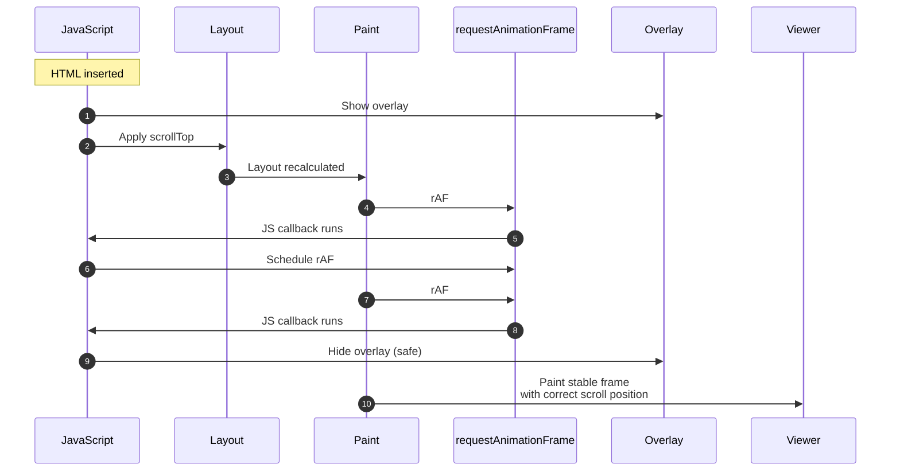

## Scroll Restoration & Timing Diagram

___A precise explanation of how DocsViewer hides scroll jumps using browser‑synchronized rendering.___

<u>__Overview__</u>
DocsViewer restores scroll position after loading new HTML content.
However, applying scrollTop immediately after inserting content causes a visible “jump” unless the UI is temporarily masked.<br>
To solve this, DocsViewer uses a frame‑synchronized overlay that hides the jump for exactly the right number of frames — no more, no less — by aligning with the browser’s rendering pipeline.<br>
This section explains why two requestAnimationFrame()-rAF- calls are sufficient, even under heavy rendering load (3D, WebGL, GPU‑intensive scenes), and how the mechanism works internally.

1. Browser Rendering Pipeline (Simplified)
Every frame, the browser performs:

>1. JavaScript
>2. Style & Layout
>3. Paint
>4. Composite

> requestAnimationFrame() fires after layout and before paint of the next frame.<br>This makes rAF the perfect synchronization point for scroll restoration.

2. Scroll Restoration Lifecycle
When DocsViewer loads a document:

>1. Insert HTML
>2. Show overlay (mask the viewer)
>3. Apply scrollTop
>4. Wait for layout to settle
>5. Wait for the next paint
>6. Hide overlay
>7. Viewer becomes visible with no jump

> This is implemented using two nested requestAnimationFrame() calls.

3. Timing Diagram (Mermaid)



3. Why Two rAFs Are Enough

>1. __rAF #1__
Fires after layout and before paint of the next frame.
This guarantees the scrollTop jump has been processed.

>2. __rAF #2__
Fires before the paint of the frame after that.
This guarantees the viewer has already been painted once with the overlay visible.

>> At this moment:

>>- the scroll jump is no longer visible
>>- the viewer is visually stable
>>- hiding the overlay is safe

>> This logic holds even if:

>>- the frame rate drops
>>- the browser is rendering 3D/WebGL
>>- layout or paint takes longer than usual

>> The timing changes, but the ordering does not.

3. Heavy Rendering Scenarios (3D, WebGL, GPU Load)

> Even under heavy load:

>- frames may take 40ms, 80ms, or 200ms
>- but rAF still fires once per frame
>- and always at the same logical moment

> So the sequence remains:

```
      Frame N: scrollTop applied
      Frame N+1: rAF #1
      Frame N+2: rAF #2 → hide overlay
```
> This makes the mechanism predictable and stable, regardless of rendering complexity.

4. Debug Mode & Timeline Recorder

> DocsViewer includes a debug mode that records:

>- scrollTop applied
>- layout ready
>- first rAF
>- second rAF
>- overlay hidden

> This produces a normalized timeline that can be displayed in a floating debug panel.

> Example:
```
      Scroll Restoration Debug
      Restored: 420px
      Max: 1280px
      Percent: 32.8%

      Timeline (ms)
      start: 0
      scroll-applied: 1
      after-first-raf: 17
      overlay-hidden: 33
```

> This makes the invisible rendering pipeline visible and teachable.

5. Summary

>- Scroll jumps occur because layout and paint are asynchronous.
>- DocsViewer hides the jump using an overlay synchronized with the browser’s frame lifecycle.
>- Two requestAnimationFrame() calls guarantee correct ordering.
>- The mechanism is stable even under heavy GPU load.
>- Debug mode provides a visual timeline for contributors.

> This approach is faster, more reliable, and more predictable than time‑based methods like setTimeout.

