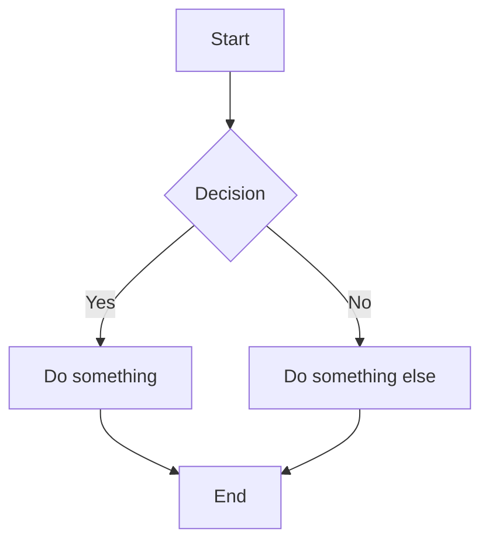

# Test Documentation (assets/docs/test/)

This is your first page rendered through Ulde.

## Mermaid Test

## Internal doc links 
Index (ID: test.index)
=================

---

Angular README
--------------

> ---
> ___This project was generated using <a href="https://github.com/angular/angular-cli" target="_blank">[Angular CLI]</a>version 21.0.0. ...___

> [details](#docId:test.angular-readme "docID: test.angular-readme")

> [Angular Lifecycle - relation to Browser frame lifecyle](#docId:test.doc-angular-0100 "docID: test.doc-angular-0100")

Application(Documentation System) README
------------------

> ---
> ___This document is the master reference for the entire documentation rendering system. It explains how Markdown is parsed, enhanced, rendered to html, and synchronized with user navigation. ...___

> [details](#docId:test.application-readme "docID: test.application-readme")

> [Lifcycle integration and plugin-ready documentation components](#docId:test.doc-app-0200 "docID: test.doc-app-0200")

Katex Test
---

> [Katex](#docId:test.katex "docID: test.katex")
